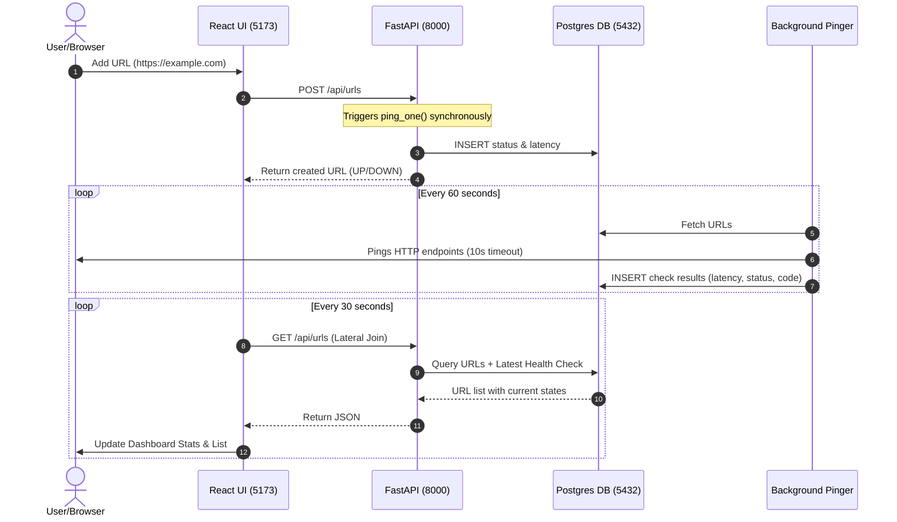
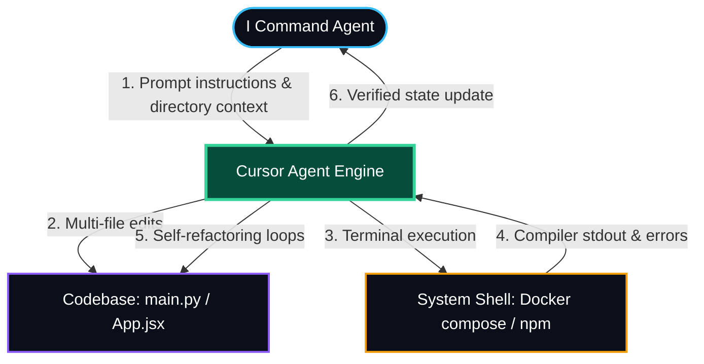
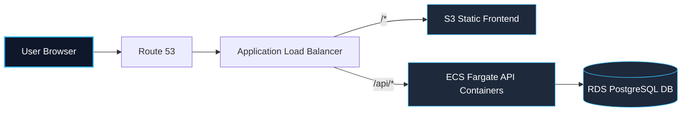

# UPtime — Lightweight Full-Stack Uptime Monitor MVP

A self-contained, high-performance URL health monitor featuring a synchronous initial check loop, a background cron pinger, and a sleek, desaturated dark dashboard.

---

## 🚀 1-Line Setup & Local Execution

- **Prerequisite**: Docker Desktop running.
- **Run Stack** (Execute in project root):
  ```bash
  docker compose up --build
  ```
- **Access Endpoints**:
  - Dashboard: [http://localhost:5173](http://localhost:5173)
  - Interactive API Docs (Swagger): [http://localhost:8000/docs](http://localhost:8000/docs)
- **Stop Stack**:
  ```bash
  docker compose down
  ```

---

## 🧪 Testing Verification

Open **[http://localhost:5173](http://localhost:5173)** and add these endpoints to test:
- **Active State**: Add `https://example.com` ──► Instantly displays 🟢 **UP** (with ms latency).
- **Network Failure**: Add `https://nonexistent-url-target.xyz` ──► Instantly displays 🔴 **DOWN** (with `—` latency).
- **HTTP Status Failure**: Add `https://httpstat.us/503` ──► Instantly displays 🔴 **DOWN** (showing `HTTP 503`).

---

## 🏗️ System Architecture & Data Lifecycle



---

## ⚖️ Technology Trade-offs

| Choice | Selected | Rejected Alternative | Why Selected |
|---|---|---|---|
| **Web API** | **FastAPI** | Flask / Express | Async performance, Pydantic validation models, auto-docs. |
| **Scheduler** | **APScheduler** | Celery + Redis | Thread-based in-process execution; avoids Redis/worker containers. |
| **Database** | **PostgreSQL** | SQLite | Safe concurrent writes across shared volumes; no Docker file locks. |
| **Architecture** | **Single-file** | Multi-Module Layout | Merged into `main.py` (~150 lines) to eliminate directory overhead. |

---

## 🤖 AI-Driven Development Loop (Cursor + Claude 3.5 Sonnet)

To achieve maximum execution velocity, the entire environment was built using **Cursor IDE powered by Claude 3.5 Sonnet** as a unified AI engineering agent.

### 1. Cursor Agent Integration Loop
I leveraged the Cursor agent to interact directly with the workspace files and local OS terminal shell:



| Tool Choice | Why Selected Over Alternatives |
|---|---|
| **Cursor + Claude 3.5 Sonnet** <br>*(Chosen)* | **Selected** because the logical reasoning of Sonnet combined with Cursor's ability to index folder contexts and execute shell commands inside the terminal allowed the scaffolding, building, and debugging of the entire stack in minutes. |
| **GitHub Copilot** <br>*(Rejected)* | **Rejected** because it is limited to line-by-line autocompletion and lacks the cross-file reasoning needed to write database schemas and configure Docker files. |
| **ChatGPT / Claude Web** <br>*(Rejected)* | **Rejected** because copy-pasting code between browser chats and local files introduces high friction and increases the risk of sync errors. |

---

### 2. My Agentic Lifecycle & Implementation Loop

I drove the Cursor coding agent through a structured lifecycle to bypass manual development bottlenecks and deploy the MVP:


- **1. PRD Define**: I analyzed the spec boundaries and directed the agent to document constraints (such as connection timeouts on dead targets) to form a clear project objective before writing code.
- **2. Harness Engineering**: I set up the environment structure. I instructed the agent to create empty configurations (`requirements.txt`, `package.json`, and Docker compose files) first to verify network ports and database volumes could initialize before adding logic.
- **3. Multi-Agent Deploy**: I executed parallel milestones. I directed the agent to concurrently generate the Postgres database schemas (`init.sql`), code backend CRUD endpoints (`main.py`), and construct the dashboard component structures (`App.jsx`).
- **4. System Integration**: I wired the frontend to the API endpoints. I bypassed local scripting policies by manual scaffolding, resolved CORS blocks, and updated the backend POST route to execute checks synchronously for immediate UI updates.

---

## 🌐 Production Cloud Topology (AWS)



### Hypothetical Terraform (IaC) Configuration
```hcl
resource "aws_ecs_cluster" "uptime" { name = "uptime" }

resource "aws_db_instance" "postgres" {
  allocated_storage = 20
  engine            = "postgres"
  instance_class    = "db.t3.micro"
  db_name           = "uptime"
  username          = "postgres"
  password          = var.db_password
  skip_final_snapshot = true
}

resource "aws_ecs_task_definition" "backend" {
  family                   = "uptime-backend"
  network_mode             = "awsvpc"
  requires_compatibilities = ["FARGATE"]
  cpu                      = "256"
  memory                   = "512"
  container_definitions    = jsonencode([{
    name  = "backend"
    image = "${var.ecr_url}:latest"
    portMappings = [{ containerPort = 8000 }]
    environment  = [{ name = "DATABASE_URL", value = "postgresql://postgres:${var.db_password}@${aws_db_instance.postgres.endpoint}/uptime" }]
  }])
}
```
