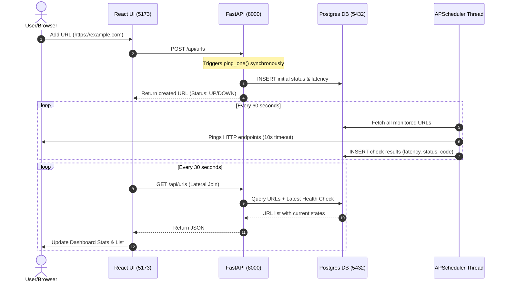
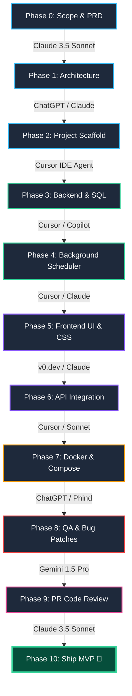
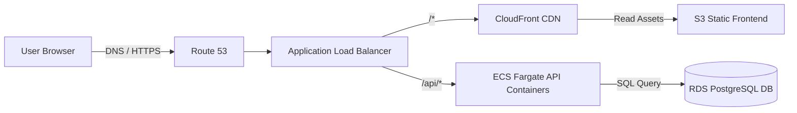

# UPtime — Uptime Monitor MVP

A lightweight, containerized full-stack URL monitor that checks website status, logs response times, and renders a clean, dark slate dashboard.

---

## 🏗️ System Flow & Architecture



---

## ⚡ Setup & Testing

### 1. Launch Stack
```bash
docker compose up --build
```
*Access the dashboard at `http://localhost:5173` and backend interactive API docs at `http://localhost:8000/docs`.*

### 2. Verify UP/DOWN Detection
- **Healthy URL**: Add `https://example.com`. It pings instantly and shows 🟢 **UP** with latency (e.g., `120ms`) and `HTTP 200`.
- **Broken URL**: Add `https://broken-domain-uptime-test.xyz`. It shows 🔴 **DOWN** with `—` latency and a network timeout log.
- **Server Error**: Add `https://httpstat.us/503`. It shows 🔴 **DOWN** showing `HTTP 503`.
- **Interactivity**: Clicking **↻ Refresh** locks the state and updates stats without page reloads.

---

## 📦 Database Schema (`init.sql`)

```sql
CREATE TABLE monitored_urls (
    id         SERIAL PRIMARY KEY,
    url        TEXT NOT NULL UNIQUE,
    label      TEXT NOT NULL DEFAULT '',
    created_at TIMESTAMPTZ DEFAULT NOW()
);

CREATE TABLE health_checks (
    id            SERIAL PRIMARY KEY,
    url_id        INTEGER REFERENCES monitored_urls(id) ON DELETE CASCADE,
    status        TEXT NOT NULL,
    status_code   INTEGER,
    response_time INTEGER,
    checked_at    TIMESTAMPTZ DEFAULT NOW()
);

CREATE INDEX idx_health_checks_url_id ON health_checks(url_id);
```

---

## ⚖️ Design Decisions & Trade-offs

| Component | Selected | Alternatives | Trade-off Analysis |
|---|---|---|---|
| **API** | **FastAPI** | Flask / Express | FastAPI provides async execution for pings, robust request validation via Pydantic, and instant interactive docs. |
| **Scheduler** | **APScheduler** | Celery + Redis | Celery requires extra worker & broker containers. APScheduler runs in a background thread inside the same API container. |
| **Database** | **Postgres 15** | SQLite | SQLite locks databases under concurrent writes and has volume sharing issues across Windows/Docker host boundaries. |
| **Backend File Structure** | **Single-file** | Modular structure | Merged routes, schema models, database connections, and scheduler loops into `main.py` (~150 lines) to eliminate folder-nesting overhead. |

---

## 🤖 Leveraging AI Agents & Tools (The Fast-Track Blueprint)

To build and ship this MVP in record time, we leveraged specialized AI models and agentic workflows at every lifecycle phase:



### Specialized AI Matrix: Best Tools for Each Task

| Development Phase | Best AI Tool / Model | Why it is the Best & How to Leverage It | Speed Optimization |
|---|---|---|---|
| **Phase 0 & 1: Requirements & Architecture** | **Claude 3.5 Sonnet** | Best in class for logical reasoning and comparative analysis. Leverage it to analyze specifications, construct PRDs, and compare tech stacks (e.g., SQLite vs Postgres). | Prevents scope creep and avoids over-engineering early. |
| **Phase 2 & 7: Scaffold & Docker Setup** | **ChatGPT (GPT-4o) / Phind** | Highly optimized for standard configuration files and system shell execution. Good at drafting default `Dockerfiles`, `docker-compose.yml`, and packages. | Speeds up initial environment configurations. |
| **Phase 3 & 4: Backend API & Scheduler** | **Cursor IDE (Agent Mode)** | Integrates directly with the system terminal and codebase context. You can command the agent to run migrations, install dependencies, and edit code inline. | Cuts down manual file-switching and route wiring time. |
| **Phase 5: Frontend UI & Styling** | **v0.dev (by Vercel)** | Generates production-ready React components and responsive styling (Tailwind/CSS) visually from screenshots or text descriptions. | Eliminates hours of CSS debugging and UI layout drafting. |
| **Phase 8 & 9: QA, Refactoring & Code Review** | **Gemini 1.5 Pro** | Huge context window (2M tokens) allows you to feed the *entire* repository codebase into a single prompt to check for logic flaws, security issues, and redundant modules. | Catches edge cases (like `0ms` truthy bugs) and performance blocks instantly. |

---

## 🌐 Production Cloud Topology (AWS)



### Terraform Infrastructure snippet
```hcl
resource "aws_ecs_cluster" "uptime" {
  name = "uptime"
}

resource "aws_db_instance" "postgres" {
  allocated_storage = 20
  engine            = "postgres"
  instance_class    = "db.t3.micro"
  db_name           = "uptime"
  username          = "postgres"
  password          = var.db_password
  skip_final_snapshot = true
}

resource "aws_ecs_task_definition" "backend" {
  family                   = "uptime-backend"
  network_mode             = "awsvpc"
  requires_compatibilities = ["FARGATE"]
  cpu                      = "256"
  memory                   = "512"
  container_definitions    = jsonencode([{
    name  = "backend"
    image = "${var.ecr_url}:latest"
    portMappings = [{ containerPort = 8000 }]
    environment  = [{ name = "DATABASE_URL", value = "postgresql://postgres:${var.db_password}@${aws_db_instance.postgres.endpoint}/uptime" }]
  }])
}
```
