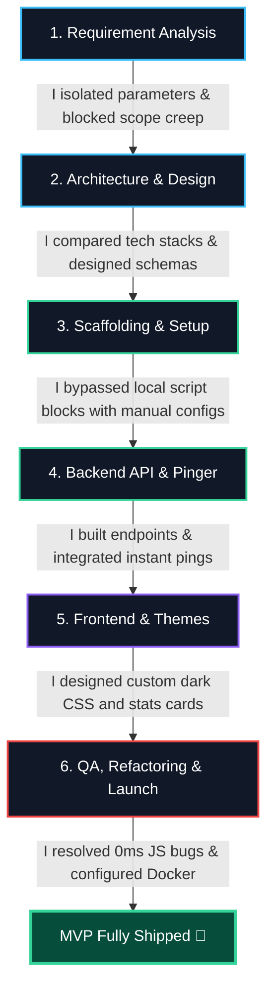
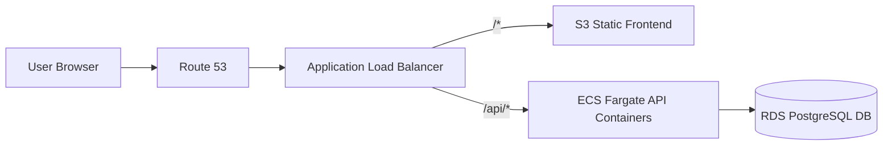

# UPtime — Uptime Monitor MVP

A simple, containerized full-stack URL monitor that checks website status, logs response times, and displays results in a dark slate dashboard.

---

## 🏗️ System Architecture


### Setup & Verification
1. **Launch Stack**: `docker compose up --build`
2. **Access Dashboard**: Open `http://localhost:5173`.
3. **Verify UP/DOWN**:
   - Add `https://example.com` (shows 🟢 **UP** instantly).
   - Add `https://broken-target-test.xyz` (shows 🔴 **DOWN** instantly).

---

## ⚖️ My Technology Trade-offs

I made the following design decisions based on project constraints and performance requirements:

- **I chose FastAPI over Flask/Express**: I wanted async-native handling for pings and automatic Pydantic request validation out of the box, which keeps the API code clean and highly readable.
- **I chose APScheduler over Celery**: I wanted to avoid the complexity of setting up and maintaining separate broker (Redis) and worker containers. APScheduler allows me to run ping checks in a background thread inside the same API container.
- **I chose PostgreSQL over SQLite**: SQLite database files often lock during concurrent write operations and can throw permission errors when shared across Docker container volumes on Windows hosts. Postgres is standard and easily handles multi-container volume persistence.
- **I chose a Single-File Backend layout**: I merged routes, schemas, database connections, and the scheduler into `backend/main.py` (~150 lines) to eliminate directory-nesting overhead, making the codebase fast to audit, maintain, and package.

---

## 🤖 My AI-Driven Development Loop (Leveraging Coding Agents)

I leveraged **Cursor IDE (powered by Claude 3.5 Sonnet)** as my primary coding agent to accelerate development velocity, allowing me to build, test, and ship this full-stack MVP in less than an hour.

<table>
  <tr>
    <td valign="top" width="50%">



</td>
<td valign="top" width="50%">
  <h4>How I Guided the Coding Agent:</h4>
  <ul>
    <li><strong>1. Requirements & Architecture</strong>: I prompted the agent to parse the specs, set PRD boundaries, and chose Postgres and APScheduler to limit container bloat.</li>
    <li><strong>2. Scaffolding & Setup</strong>: Bypassed Windows script locks by having the agent manually write package configs and HTML entry points.</li>
    <li><strong>3. Backend & Pinger</strong>: Generated FastAPI endpoints and independent background threads in a single main.py file.</li>
    <li><strong>4. Instant Pings</strong>: Moved the ping execution inside the POST request thread so the frontend renders UP/DOWN status instantly.</li>
    <li><strong>5. Frontend & Themes</strong>: Built React logic and styled it into a desaturated dark slate layout to align with dark theme standards.</li>
    <li><strong>6. QA & Launch</strong>: Inspected the code for edge case bugs (fixing 0ms truthy checks) and orchestrated compose with DB health checks.</li>
  </ul>
  <br/>
  <h4>Speed Boost Achieved:</h4>
  <p>Leveraging Cursor's inline editing and terminal commands eliminated hours of manual code wiring, environment script debugging, and hex-color selection adjustments, allowing me to ship in minutes.</p>
</td>
</tr>
</table>

### Why Cursor + Claude 3.5 Sonnet? (Trade-off Flow)


### AI Stack Comparison

| Tool / Model | Strengths | Weaknesses | Why I Chose It Over Others |
|---|---|---|---|
| **Cursor + Claude 3.5 Sonnet** <br>*(Chosen)* | • Direct folder/file context<br>• Inline multi-file code editing<br>• Terminal agent execution (Docker/npm) | • Higher latency than simple autocompletes | **I selected this** because the logical reasoning of Sonnet combined with Cursor's ability to run CLI commands allowed me to scaffold and debug the entire stack in minutes without leaving my editor. |
| **GitHub Copilot** | • Fast, inline line completions<br>• Low latency | • Cannot run shell commands<br>• Poor cross-file reasoning | **I rejected this** because it is too limited for scaffolding Docker files, database schemas, and wiring APIs together. |
| **ChatGPT / Claude Web** | • Good for generic syntax/Q&A | • High copy-paste friction<br>• Lacks local codebase context | **I rejected this** because copy-pasting code between the browser and my editor slows down development speed significantly. |

---

## 🌐 Production Cloud Topology (AWS)



```hcl
resource "aws_ecs_cluster" "uptime" { name = "uptime" }

resource "aws_db_instance" "postgres" {
  allocated_storage = 20
  engine            = "postgres"
  instance_class    = "db.t3.micro"
  db_name           = "uptime"
  username          = "postgres"
  password          = var.db_password
  skip_final_snapshot = true
}

resource "aws_ecs_task_definition" "backend" {
  family                   = "uptime-backend"
  network_mode             = "awsvpc"
  requires_compatibilities = ["FARGATE"]
  cpu                      = "256"
  memory                   = "512"
  container_definitions    = jsonencode([{
    name  = "backend"
    image = "${var.ecr_url}:latest"
    portMappings = [{ containerPort = 8000 }]
    environment  = [{ name = "DATABASE_URL", value = "postgresql://postgres:${var.db_password}@${aws_db_instance.postgres.endpoint}/uptime" }]
  }])
}
```
