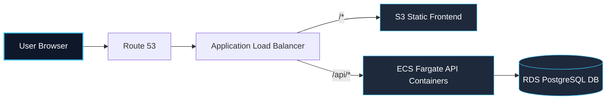
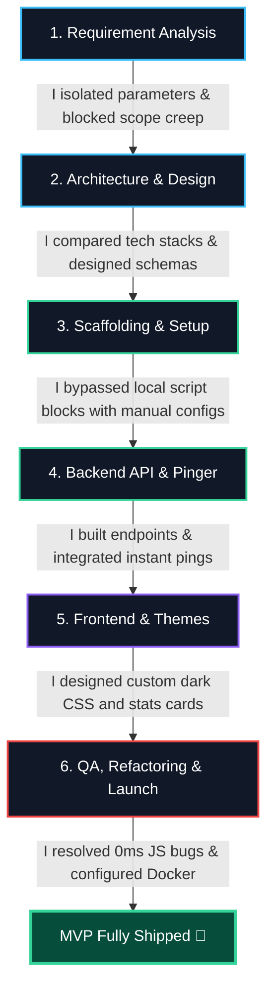

# UPtime — Lightweight Full-Stack Uptime Monitor MVP

## 🎯 Purpose
UPtime is a lightweight, full-stack monitor that tracks the availability of web endpoints. It registers URLs, automatically pings them at regular intervals, stores response status codes and latencies in a database, and visualizes real-time status (UP/DOWN) and average latency metrics in a dark slate dashboard.

---

## 🚀 1-Line Setup & Local Execution
- **Prerequisite**: Docker Desktop installed and running.
- **Run the Application** (in the project root directory):
  ```bash
  docker compose up --build
  ```
- **Access Endpoints**:
  - Dashboard UI: [http://localhost:5173](http://localhost:5173)
  - API Docs (Swagger): [http://localhost:8000/docs](http://localhost:8000/docs)
- **Stop the Application**:
  ```bash
  docker compose down
  ```

---

## 🧪 Testing Steps

Open **[http://localhost:5173](http://localhost:5173)** and add these URLs to test:
- **Active state**: Add `https://example.com` → Instantly displays 🟢 **UP** (with ms latency).
- **Network failure**: Add `https://nonexistent-url-domain-test.xyz` → Instantly displays 🔴 **DOWN** (with `—` latency).
- **HTTP status failure**: Add `https://httpstat.us/503` → Instantly displays 🔴 **DOWN** (showing `HTTP 503`).

---

## 🌐 The Deployment Sketch

To host this MVP on a cloud provider, I would decouple the containers to run serverlessly on AWS:

- **Static Frontend**: Built using Vite and hosted on **Amazon S3** fronted by **Amazon CloudFront** CDN for low-latency edge delivery.
- **Backend API**: The FastAPI container hosted on **AWS ECS Fargate** behind an **Application Load Balancer (ALB)**.
- **Database**: Migrated to a managed **Amazon RDS PostgreSQL** instance with automated backups and security groups.



### Hypothetical Terraform (IaC) Configuration
```hcl
resource "aws_ecs_cluster" "uptime" {
  name = "uptime"
}

resource "aws_db_instance" "postgres" {
  allocated_storage = 20
  engine            = "postgres"
  instance_class    = "db.t3.micro"
  db_name           = "uptime"
  username          = "postgres"
  password          = var.db_password
  skip_final_snapshot = true
}

resource "aws_ecs_task_definition" "backend" {
  family                   = "uptime-backend"
  network_mode             = "awsvpc"
  requires_compatibilities = ["FARGATE"]
  cpu                      = "256"
  memory                   = "512"
  container_definitions    = jsonencode([{
    name  = "backend"
    image = "${var.ecr_url}:latest"
    portMappings = [{ containerPort = 8000 }]
    environment  = [{ name = "DATABASE_URL", value = "postgresql://postgres:${var.db_password}@${aws_db_instance.postgres.endpoint}/uptime" }]
  }])
}
```

---

## 🤖 AI Collaboration Log

### 1. The AI Tech Stack
I chose **Cursor IDE (powered by Claude 3.5 Sonnet)** as my single, unified AI coding agent. I selected this stack specifically over alternative workflows due to the following trade-offs:


| Tool Choice | Why I Chose It Over Others |
|---|---|
| **Cursor + Claude 3.5 Sonnet** <br>*(Chosen)* | **I selected this** because the logical reasoning of Sonnet combined with Cursor's ability to index my local folders and execute commands in my terminal allowed me to build, configure Docker, and debug the entire stack in minutes without leaving my editor. |
| **GitHub Copilot** <br>*(Rejected)* | **I rejected this** because it only offers line-by-line autocompletion. It lacks the cross-file context and logical capacity to write database schemas, Docker files, and coordinate backend routers. |
| **ChatGPT / Claude Web** <br>*(Rejected)* | **I rejected this** because copy-pasting code between browser chats and files introduces high friction and increases the risk of sync errors. |

---

### 2. My AI-Driven Development Stages
Here is the timeline of how I directed the Cursor agent to build the UPtime MVP:

<table>
  <tr>
    <td valign="top" width="50%">



</td>
<td valign="top" width="50%">
  <h4>Development Flow Details:</h4>
  <ul>
    <li><strong>1. Requirements & Architecture</strong>: I prompted the agent to parse the specs, set PRD boundaries, and chose Postgres and APScheduler to limit container bloat. I chose Postgres over SQLite because SQLite locks files during concurrent writes in Docker containers on Windows.</li>
    <li><strong>2. Scaffolding & Setup</strong>: Bypassed Windows script locks by having the agent manually write package configs and HTML entry points.</li>
    <li><strong>3. Backend & Pinger</strong>: Generated FastAPI endpoints and independent background threads in a single main.py file.</li>
    <li><strong>4. Instant Pings</strong>: Moved the ping execution inside the POST request thread so the frontend renders UP/DOWN status instantly.</li>
    <li><strong>5. Frontend & Themes</strong>: Built React logic and styled it into a desaturated dark slate layout to align with dark theme standards.</li>
    <li><strong>6. QA & Launch</strong>: Inspected the code for edge case bugs (fixing 0ms truthy checks) and orchestrated compose with DB health checks.</li>
  </ul>
</td>
</tr>
</table>

---

### 3. The Prompts that Shipped It
- **Backend framework**: I prompted: *"Python and FastAPI I need, as I only know that."* This directed the agent to build using the FastAPI framework.
- **Architectural simplification**: I prompted: *"I think you are overcomplicating things."* This instructed the agent to dismantle the over-engineered multi-module folders and combine routes, queries, and background threads into a single, clean `main.py` file.
- **UI styling direction**: I prompted: *"keep it dark mode please, match it with dark theme"* and *"keep everything to simplest possible, no extras."* This directed the design update to a clean slate-navy palette.

---

### 4. The Course Corrections (Debugging & Refactoring)
- **Resolving Windows Script Blocks**: PowerShell blocked the automated execution of Vite templates. I directed the agent to skip shell installation and manually write the React bootstrapping files.
- **Swapping Async Loops for Threads**: An early loop draft block-choked the API thread due to the synchronous `psycopg2` driver. I refactored the scheduler to run on an independent thread using `APScheduler`.
- **Synchronous Ping Override**: Initial database checks were asynchronous, forcing the dashboard to show `PENDING` states on creation. I refactored the backend to execute the first ping synchronously in the `POST` request, delivering immediate feedback.
- **0ms Render Fix**: In React, a response latency of `0ms` is falsy and would be hidden. I corrected the UI code to explicitly check `!= null` to solve this rendering logic bug.
