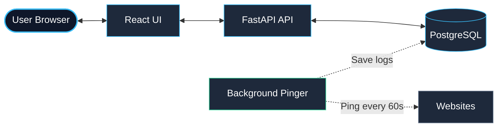
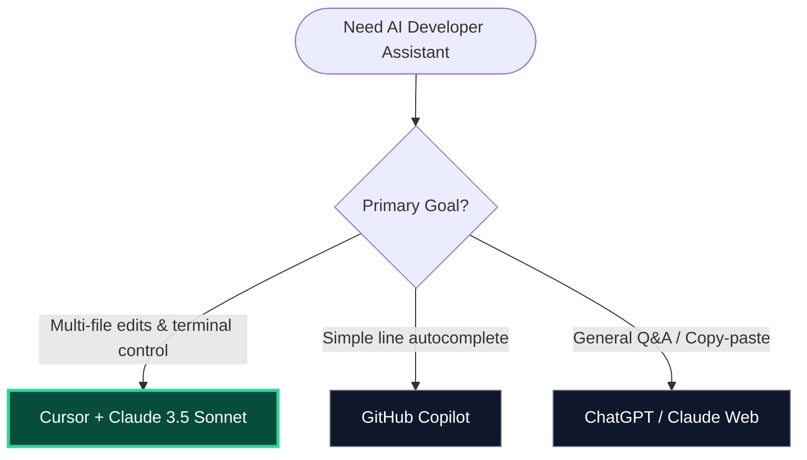
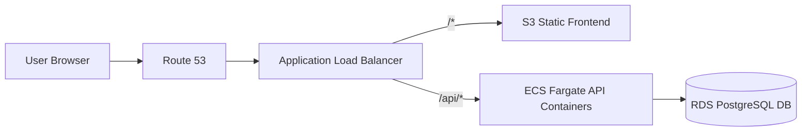

# UPtime — Uptime Monitor MVP

A simple, containerized full-stack URL monitor that checks website status, logs response times, and displays results in a dark slate dashboard.

---

## 🏗️ System Architecture



### Setup & Verification
1. **Launch Stack**: `docker compose up --build`
2. **Access Dashboard**: Open `http://localhost:5173`.
3. **Verify UP/DOWN**:
   - Add `https://example.com` (shows 🟢 **UP** instantly).
   - Add `https://broken-target-test.xyz` (shows 🔴 **DOWN** instantly).

---

## ⚖️ Technology Trade-offs

- **FastAPI vs Flask**: FastAPI provides async-native handling for pings and automatic Pydantic request validation.
- **APScheduler vs Celery**: Celery requires extra Redis/worker containers. APScheduler runs in a background thread inside the API container.
- **PostgreSQL vs SQLite**: SQLite locks database files under write concurrency across Docker container volumes.
- **Single-File Backend**: Merged routes, pinger, database, and logic into `main.py` (~150 lines) to eliminate nested file overhead.

---

## 🤖 The AI Developer Stack (Cursor + Claude 3.5 Sonnet)

To build and ship this MVP at maximum speed, we chose **Cursor IDE powered by Claude 3.5 Sonnet** as our unified engineering stack. 

### Why Cursor + Claude 3.5 Sonnet? (Trade-off Flow)



### AI Stack Comparison

| Tool / Model | Strengths | Weaknesses | Why Chosen / Rejected |
|---|---|---|---|
| **Cursor + Claude 3.5 Sonnet** <br>*(Chosen)* | • Direct folder/file context<br>• Inline multi-file code editing<br>• Terminal agent execution (Docker/npm) | • Higher latency than simple autocompletes | **Selected**: The logical reasoning of Sonnet combined with Cursor's ability to run CLI commands allowed us to scaffold and debug the entire stack in minutes. |
| **GitHub Copilot** | • Fast, inline line completions<br>• Low latency | • Cannot run shell commands<br>• Poor cross-file reasoning | **Rejected**: Too limited for scaffolding Docker files, database schemas, and wiring APIs together. |
| **ChatGPT / Claude Web** | • Good for generic syntax/Q&A | • High copy-paste friction<br>• Lacks local codebase context | **Rejected**: Slows down development due to manual file creation and context syncing. |

### How AI Was Leveraged Across Phases
1. **Requirements & Architecture**: Used Claude 3.5 Sonnet to map out PRD scope boundaries and draft SQL table schemas.
2. **Scaffolding & Boilerplate**: Leveraged Cursor's Terminal Agent to create directories and write package dependency files.
3. **Backend & Pinger**: Commanded Cursor to implement synchronous initial checks in `main.py` to support instant UI state rendering.
4. **UI Styling**: Prompts in Cursor quickly compiled the sleek dark theme CSS without manual color debugging.
5. **Code Review & QA**: Used the large context window to scan the completed code, patching logic edge cases (like handling `0ms` response times).

---

## 🌐 Production Cloud Topology (AWS)



```hcl
resource "aws_ecs_cluster" "uptime" { name = "uptime" }

resource "aws_db_instance" "postgres" {
  allocated_storage = 20
  engine            = "postgres"
  instance_class    = "db.t3.micro"
  db_name           = "uptime"
  username          = "postgres"
  password          = var.db_password
  skip_final_snapshot = true
}

resource "aws_ecs_task_definition" "backend" {
  family                   = "uptime-backend"
  network_mode             = "awsvpc"
  requires_compatibilities = ["FARGATE"]
  cpu                      = "256"
  memory                   = "512"
  container_definitions    = jsonencode([{
    name  = "backend"
    image = "${var.ecr_url}:latest"
    portMappings = [{ containerPort = 8000 }]
    environment  = [{ name = "DATABASE_URL", value = "postgresql://postgres:${var.db_password}@${aws_db_instance.postgres.endpoint}/uptime" }]
  }])
}
```
