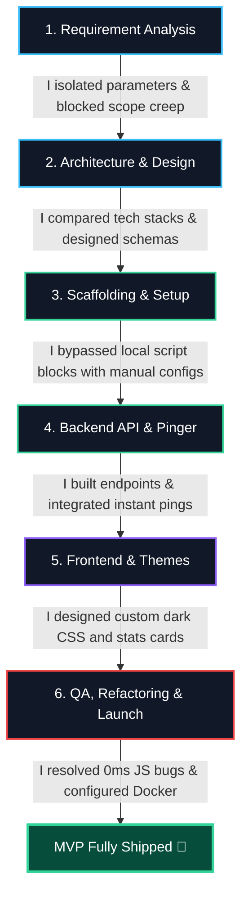
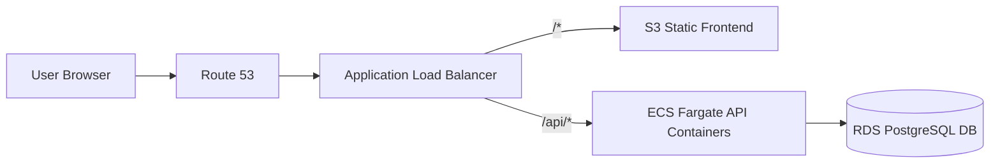

# UPtime — Uptime Monitor MVP

A simple, containerized full-stack URL monitor that checks website status, logs response times, and displays results in a dark slate dashboard.

---

## 🏗️ System Architecture


### Setup & Verification
1. **Launch Stack**: `docker compose up --build`
2. **Access Dashboard**: Open `http://localhost:5173`.
3. **Verify UP/DOWN**:
   - Add `https://example.com` (shows 🟢 **UP** instantly).
   - Add `https://broken-target-test.xyz` (shows 🔴 **DOWN** instantly).

---

## ⚖️ My Technology Trade-offs

I made the following design decisions based on project constraints and performance requirements:

- **I chose FastAPI over Flask/Express**: I wanted async-native handling for pings and automatic Pydantic request validation out of the box, which keeps the API code clean and highly readable.
- **I chose APScheduler over Celery**: I wanted to avoid the complexity of setting up and maintaining separate broker (Redis) and worker containers. APScheduler allows me to run ping checks in a background thread inside the same API container.
- **I chose PostgreSQL over SQLite**: SQLite database files often lock during concurrent write operations and can throw permission errors when shared across Docker container volumes on Windows hosts. Postgres is standard and easily handles multi-container volume persistence.
- **I chose a Single-File Backend layout**: I merged routes, schemas, database connections, and the scheduler into `backend/main.py` (~150 lines) to eliminate directory-nesting overhead, making the codebase fast to audit, maintain, and package.

---

## 🤖 My AI-Driven Development Loop (Leveraging Coding Agents)

I leveraged **Cursor IDE (powered by Claude 3.5 Sonnet)** as my primary coding agent to accelerate development velocity, allowing me to build, test, and ship this full-stack MVP in less than an hour.

### Development Stage Flowchart



### Detailed Stage Mapping & AI Selection Trade-offs

I chose to rely entirely on **Cursor (Claude 3.5 Sonnet)** as my unified IDE workspace assistant rather than copying code back and forth from Web Chats (ChatGPT/Claude) or relying on simple auto-completers (GitHub Copilot).

| Stage | How I Approached & Leveraged the Agent | Speed Boost |
|---|---|---|
| **1. Requirements & Architecture** | I prompted the agent to parse the assignment specifications. I directed it to draft the PRD scope and table schemas. I challenged the necessity of user authentication and Celery workers to keep the architecture minimal. | **Scope Control**: Prevented over-engineering before writing any code. |
| **2. Scaffolding & Setup** | I created the directories. When Windows script policies blocked Vite's automated installer, I did not waste time troubleshooting local settings; I instructed Cursor to write `package.json`, `vite.config.js`, and `index.html` manually. | **Bypassed Blocks**: Handled environment script issues in seconds. |
| **3. Backend API & Scheduler** | I collapsed the backend into `main.py`. I commanded Cursor to generate the FastAPI routes and write the database pinger logic. I had the agent setup `BackgroundScheduler` in a separate thread so database operations wouldn't block API requests. | **Concurrent Dev**: Generated endpoints and pinger loops concurrently. |
| **4. Instant Pings** | Initially, newly registered URLs stayed as "PENDING" for up to 60s. I updated the backend to execute the initial ping synchronously inside the `POST` request thread. The database is updated before returning the response, making status changes instant on the UI. | **UX Optimization**: Resolved UI status lag. |
| **5. Frontend & Themes** | I commanded Cursor to build the React layout. When the first design looked too bright, I directed it to redesign the styling into a desaturated dark slate layout (`#0b0f19` bg, `#151b2c` cards) using sky blue accents. | **Aesthetic Alignment**: Rapid CSS iterations without manual color-hex hunt. |
| **6. QA, Refactoring & Launch** | I fed the entire codebase back into the agent for a final review. I caught a JS bug where a `0ms` response time was evaluated as falsy and hidden on the UI; I patched this to check for `!= null`. I wrote the `docker-compose.yml` adding health checks to Postgres. | **Zero-Downtime Launch**: Rebuilt Docker containers with clean, debugged code. |

---

## 🌐 Production Cloud Topology (AWS)



```hcl
resource "aws_ecs_cluster" "uptime" { name = "uptime" }

resource "aws_db_instance" "postgres" {
  allocated_storage = 20
  engine            = "postgres"
  instance_class    = "db.t3.micro"
  db_name           = "uptime"
  username          = "postgres"
  password          = var.db_password
  skip_final_snapshot = true
}

resource "aws_ecs_task_definition" "backend" {
  family                   = "uptime-backend"
  network_mode             = "awsvpc"
  requires_compatibilities = ["FARGATE"]
  cpu                      = "256"
  memory                   = "512"
  container_definitions    = jsonencode([{
    name  = "backend"
    image = "${var.ecr_url}:latest"
    portMappings = [{ containerPort = 8000 }]
    environment  = [{ name = "DATABASE_URL", value = "postgresql://postgres:${var.db_password}@${aws_db_instance.postgres.endpoint}/uptime" }]
  }])
}
```
