# UPtime — Uptime Monitor MVP

A lightweight, full-stack URL uptime monitor that pings target websites, logs latency/HTTP status codes, and displays real-time health statistics in a sleek, desaturated dark dashboard.

---

## ⚡ 1-Line Setup

Run the following command to build and launch the database, API service, and frontend dashboard:

```bash
docker compose up --build
```

- **Frontend Dashboard**: [http://localhost:5173](http://localhost:5173)
- **FastAPI Interactive Docs**: [http://localhost:8000/docs](http://localhost:8000/docs)

---

## 🧪 Verification & Testing Steps

1. Open **[http://localhost:5173](http://localhost:5173)**.
2. Add a **Healthy URL**:
   - URL: `https://example.com` | Label: `Healthy`
   - *Behavior*: Backend performs an **instant ping** synchronously. The card renders immediately as 🟢 **UP** with latency (e.g. `124ms`) and `HTTP 200`.
3. Add a **Broken URL**:
   - URL: `https://nonexistent-url-target.xyz` | Label: `Broken`
   - *Behavior*: Card renders immediately as 🔴 **DOWN** with `—` latency.
4. Add a **Non-2xx URL**:
   - URL: `https://httpstat.us/503` | Label: `Error`
   - *Behavior*: Card renders immediately as 🔴 **DOWN** showing `HTTP 503`.
5. Click **↻ Refresh**: The button changes to `Refreshing...` and disables while fetching DB updates to prevent redundant request overlapping.

---

## 🏗️ Architecture & Trade-offs

```
[ Frontend: React / Vite ] ◄─── HTTP (JSON) ───► [ Backend: FastAPI / Uvicorn ]
                                                        │
                                            (Background Thread: APScheduler)
                                                        │
                                                        ▼
                                                 [ Database: Postgres 15 ]
```

### Key Decisions
- **FastAPI over Flask**: Handles concurrent async requests easily, validates requests via Pydantic, and generates interactive `/docs`.
- **APScheduler over Celery**: Celery requires heavy Redis/RabbitMQ containers. APScheduler pings targets in a lightweight background thread inside the API process.
- **Postgres over SQLite**: Cross-container volume mappings for SQLite on Windows often cause database write locks. Postgres is robust and standard for deployment.
- **Single-File Backend**: Mapped the entire backend schema, routes, pinger, and config into a single file (`backend/main.py`) to reduce boilerplate complexity.

---

## 🤖 AI Collaboration Diagram (How AI Was Used)

The timeline below illustrates how the User collaborated with the AI Assistant across each development phase to ship the MVP:

```mermaid
graph TD
    P0[Phase 0: Requirements PM] -->|AI analyzed the constraints & defined the PRD scope| P1[Phase 1: Architecture Staff]
    P1 -->|AI mapped technical decisions & debated SQLite vs Postgres| P2[Phase 2: Scaffold DevOps]
    P2 -->|AI generated file tree & wrote manual Vite configurations| P3[Phase 3: Backend Dev]
    P3 -->|AI built CRUD routes with parameterized SQL statements| P4[Phase 4: Scheduler Dev]
    P4 -->|AI implemented thread schedulers & synchronous initial checks| P5[Phase 5: Frontend Dev]
    P5 -->|AI built React layouts & desaturated slate dark styling| P6[Phase 6: Integration Fullstack]
    P6 -->|AI connected UI fetch calls to API and configured CORS| P7[Phase 7: Orchestration DevOps]
    P7 -->|AI compiled Docker Compose & DB pg_isready health checks| P8[Phase 8: QA & Debug]
    P8 -->|AI fixed 0ms response rendering logic & disabled button spins| P9[Phase 9: PR Code Review]
    P9 -->|AI stripped redundant route helpers for a clean single-file layout| P10[Phase 10: Docs Writer]
    P10 -->|AI compiled this README document| End[Ship MVP 🚀]
    
    style P0 fill:#1e293b,stroke:#3b82f6,stroke-width:2px,color:#fff
    style P1 fill:#1e293b,stroke:#3b82f6,stroke-width:2px,color:#fff
    style P2 fill:#1e293b,stroke:#3b82f6,stroke-width:2px,color:#fff
    style P3 fill:#1e293b,stroke:#10b981,stroke-width:2px,color:#fff
    style P4 fill:#1e293b,stroke:#10b981,stroke-width:2px,color:#fff
    style P5 fill:#1e293b,stroke:#8b5cf6,stroke-width:2px,color:#fff
    style P6 fill:#1e293b,stroke:#8b5cf6,stroke-width:2px,color:#fff
    style P7 fill:#1e293b,stroke:#f59e0b,stroke-width:2px,color:#fff
    style P8 fill:#1e293b,stroke:#ef4444,stroke-width:2px,color:#fff
    style P9 fill:#1e293b,stroke:#ec4899,stroke-width:2px,color:#fff
    style P10 fill:#1e293b,stroke:#64748b,stroke-width:2px,color:#fff
    style End fill:#064e3b,stroke:#10b981,stroke-width:3px,color:#fff
```



### Detailed AI Assistance Log:
- **Scaffolding Bypass**: PowerShell locked Vite scripting, so the AI designed a custom manual setup file by file to build Vite.
- **Async Execution Blocks**: Swapped async event loops for a threaded background pinger to prevent blocking during database calls.
- **Synchronous POST checks**: Moved the pinger execution into the POST loop to return first pings instantly on addition.
- **QA Patches**: Fixed React's truthy checking bug which hid `0ms` response times.

---

## 🌐 Production Cloud Topology (AWS)

```
[ Route 53 ] ──► [ ALB ] ──┬── /api/* ──► [ ECS Fargate Containers ]
                           └── /*     ──► [ S3 + CloudFront CDN ]
                                                   │
                                                   ▼
                                        [ RDS PostgreSQL db.t3.micro ]
```

### Terraform Mock-up
```hcl
resource "aws_ecs_cluster" "uptime" {
  name = "uptime-cluster"
}

resource "aws_db_instance" "postgres" {
  allocated_storage = 20
  engine            = "postgres"
  instance_class    = "db.t3.micro"
  db_name           = "uptime"
  username          = "postgres"
  password          = var.db_password
  skip_final_snapshot = true
}

resource "aws_ecs_task_definition" "backend" {
  family                   = "uptime-backend"
  network_mode             = "awsvpc"
  requires_compatibilities = ["FARGATE"]
  cpu                      = "256"
  memory                   = "512"
  container_definitions    = jsonencode([{
    name  = "backend"
    image = "${var.ecr_url}:latest"
    portMappings = [{ containerPort = 8000 }]
    environment  = [{ name = "DATABASE_URL", value = "postgresql://postgres:${var.db_password}@${aws_db_instance.postgres.endpoint}/uptime" }]
  }])
}
```
