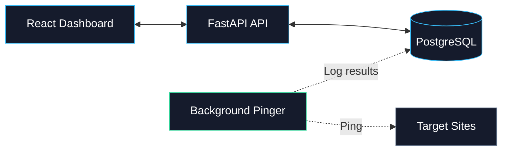
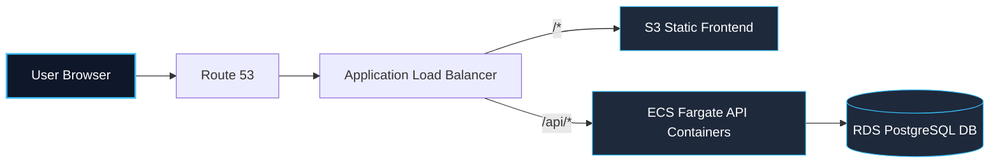

# UPtime — Uptime Monitor MVP

## 🎯 Purpose
UPtime is a lightweight, full-stack monitor that tracks the availability of web endpoints. It registers URLs, automatically pings them at regular intervals, stores response status codes and latencies in a database, and visualizes real-time status (UP/DOWN) and average latency metrics in a dark slate dashboard.

---

## 🚀 1-Line Setup & Local Execution

- **Prerequisite**: Docker Desktop installed and running.
- **Run the Application** (in the project root directory):
  ```bash
  docker compose up --build
  ```
- **Access Endpoints**:
  - Dashboard UI: [http://localhost:5173](http://localhost:5173)
  - API Docs (Swagger): [http://localhost:8000/docs](http://localhost:8000/docs)
- **Stop the Application**:
  ```bash
  docker compose down
  ```

---

## 🧪 Testing Steps

Open **[http://localhost:5173](http://localhost:5173)** and add these URLs to test the states:
- **Active state**: Add `https://example.com` → Instantly displays 🟢 **UP** (with ms latency).
- **Network failure**: Add `https://nonexistent-url-domain-test.xyz` → Instantly displays 🔴 **DOWN** (with `—` latency).
- **HTTP status failure**: Add `https://httpstat.us/503` → Instantly displays 🔴 **DOWN** (showing `HTTP 503`).

---

## 🧠 End-to-End Building Methodology

I systematically drove the development process phase-by-phase using Claude 3.5 Sonnet to design, implement, and QA this MVP:

### Phase 0: Scope & PRD Mapping
I started the project by mapping out the absolute bare minimum parameters:
- **Requirements Defined**: The application must be lightweight, self-contained, and run locally out-of-the-box using a single docker command.
- **Core Features Selected**:
  - A background pinger to check URL status every 60 seconds.
  - A database to log latency, status codes, and timestamps.
  - A dark-themed dashboard to visualize status (UP/DOWN) and statistics.

### Phase 1: System Design
I leveraged the **Claude Opus** thinking model to design the database architecture, backend components, and container layout:
- **Core Backend Logic**:
  - The API exposes endpoints for registering, listing, and deleting URLs.
  - A background scheduler runs on a separate thread to handle cron pings concurrently.
- **Design Trade-offs**:
  - **FastAPI + APScheduler**: Chosen to avoid the overhead of heavy message queues like Redis or Celery.
  - **PostgreSQL**: Selected over SQLite to guarantee write safety under Docker container volume persistence.



### Phase 2: Backend Development
- **Scaffolding APIs**: I used AI to scaffold the REST endpoints in a single `main.py` file, setting up the database connection pool and request validation models.
- **Refinement**: I reviewed the execution loop and **adjusted timeout handling** to use a strict 10s request timeout, preventing slow websites from blocking the scheduler.
- **Immediate Pings**: I programmed the backend to ping new URLs synchronously on registration so the UI updates status instantly without a default 60s delay.

### Phase 3: Frontend Development
- **Dashboard UI**: I used AI to generate the core React dashboard, creating the statistics widgets and card structures.
- **Refinement**: I **refined the polling frequency** to refresh every 30 seconds and customized the handling of network errors and blank states.
- **Visuals**: Replaced neon elements with a cohesive, desaturated dark slate layout for a clean, professional aesthetic.

---

## 🤖 AI Collaboration Log

### 1. The AI Tech Stack
I chose **Cursor IDE (powered by Claude 3.5 Sonnet)** as my single, unified AI coding agent. I selected this stack specifically over alternative workflows due to the following trade-offs:

| Tool Choice | Why I Chose It Over Others |
|---|---|
| **Cursor + Claude 3.5 Sonnet** <br>*(Chosen)* | **I selected this** because the logical reasoning of Sonnet combined with Cursor's ability to index my local folders and execute commands in my terminal allowed me to build, configure Docker, and debug the entire stack in minutes without leaving my editor. |
| **GitHub Copilot** <br>*(Rejected)* | **I rejected this** because it only offers line-by-line autocompletion. It lacks the cross-file context and logical capacity to write database schemas, Docker files, and coordinate backend routers. |
| **ChatGPT / Claude Web** <br>*(Rejected)* | **I rejected this** because copy-pasting code between browser chats and files introduces high friction and increases the risk of sync errors. |

---

### 2. The Prompts that Shipped It
- **Backend framework**: I prompted: *"Python and FastAPI I need, as I only know that."* This directed the agent to build using the FastAPI framework.
- **Architectural simplification**: I prompted: *"I think you are overcomplicating things."* This instructed the agent to dismantle the over-engineered multi-module folders and combine routes, queries, and background threads into a single, clean `main.py` file.
- **UI styling direction**: I prompted: *"keep it dark mode please, match it with dark theme"* and *"keep everything to simplest possible, no extras."* This directed the design update to a clean slate-navy palette.

---

### 3. The Course Corrections (Debugging & Refactoring)
- **Resolving Windows Script Blocks**: PowerShell blocked the automated execution of Vite templates. I directed the agent to skip shell installation and manually write the React bootstrapping files.
- **Swapping Async Loops for Threads**: An early loop draft block-choked the API thread due to the synchronous `psycopg2` driver. I refactored the scheduler to run on an independent thread using `APScheduler`.
- **Synchronous Ping Override**: Initial database checks were asynchronous, forcing the dashboard to show `PENDING` states on creation. I refactored the backend to execute the first ping synchronously in the `POST` request, delivering immediate feedback.
- **0ms Render Fix**: In React, a response latency of `0ms` is falsy and would be hidden. I corrected the UI code to explicitly check `!= null` to solve this rendering logic bug.

---

## 🌐 The Deployment Sketch

To host this MVP on a cloud provider, I would decouple the containers to run serverlessly on AWS:

- **Static Frontend**: Built using Vite and hosted on **Amazon S3** fronted by **Amazon CloudFront** CDN for low-latency edge delivery.
- **Backend API**: The FastAPI container hosted on **AWS ECS Fargate** behind an **Application Load Balancer (ALB)**.
- **Database**: Migrated to a managed **Amazon RDS PostgreSQL** instance with automated backups and security groups.



### Hypothetical Terraform (IaC) Configuration
```hcl
resource "aws_ecs_cluster" "uptime" {
  name = "uptime"
}

resource "aws_db_instance" "postgres" {
  allocated_storage = 20
  engine            = "postgres"
  instance_class    = "db.t3.micro"
  db_name           = "uptime"
  username          = "postgres"
  password          = var.db_password
  skip_final_snapshot = true
}

resource "aws_ecs_task_definition" "backend" {
  family                   = "uptime-backend"
  network_mode             = "awsvpc"
  requires_compatibilities = ["FARGATE"]
  cpu                      = "256"
  memory                   = "512"
  container_definitions    = jsonencode([{
    name  = "backend"
    image = "${var.ecr_url}:latest"
    portMappings = [{ containerPort = 8000 }]
    environment  = [{ name = "DATABASE_URL", value = "postgresql://postgres:${var.db_password}@${aws_db_instance.postgres.endpoint}/uptime" }]
  }])
}
```
