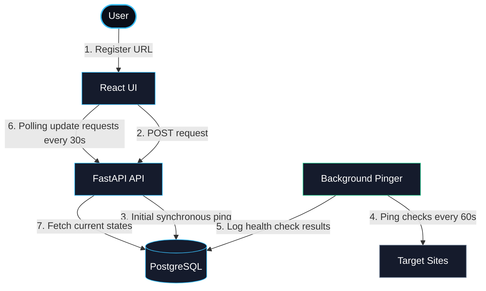
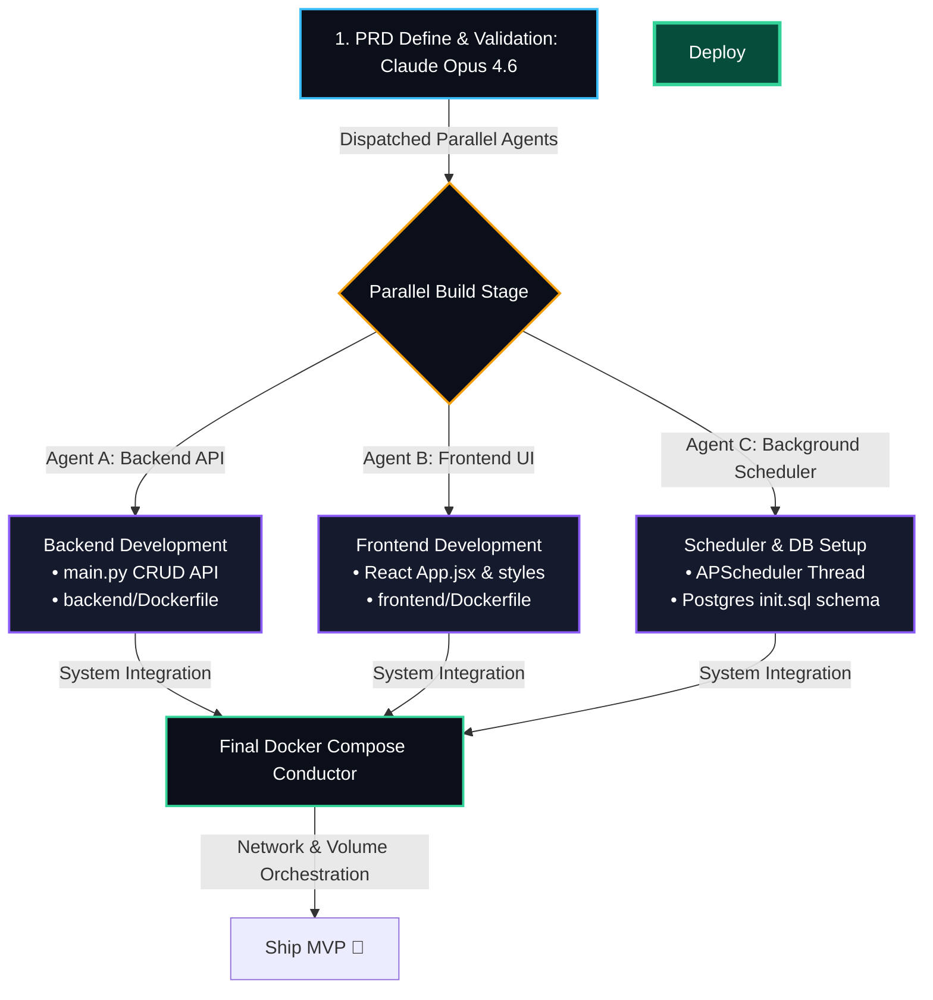
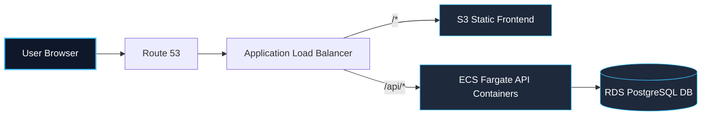

# UPtime — Lightweight Full-Stack Uptime Monitor MVP

A self-contained, high-performance URL health monitor featuring a synchronous initial check loop, a background cron pinger, and a sleek, desaturated dark dashboard.

---

## 🚀 1-Line Setup & Local Execution

- **Prerequisite**: Docker Desktop running.
- **Run Stack** (Execute in project root):
  ```bash
  docker compose up --build
  ```
- **Access Endpoints**:
  - Dashboard: [http://localhost:5173](http://localhost:5173)
  - Interactive API Docs (Swagger): [http://localhost:8000/docs](http://localhost:8000/docs)
- **Stop Stack**:
  ```bash
  docker compose down
  ```

---

## 🧪 Testing Verification

Open **[http://localhost:5173](http://localhost:5173)** and add these endpoints to test:
- **Active State**: Add `https://example.com` ──► Instantly displays 🟢 **UP** (with ms latency).
- **Network Failure**: Add `https://nonexistent-url-target.xyz` ──► Instantly displays 🔴 **DOWN** (with `—` latency).
- **HTTP Status Failure**: Add `https://httpstat.us/503` ──► Instantly displays 🔴 **DOWN** (showing `HTTP 503`).

## 🏗️ System Architecture & Data Flow



---

## ⚖️ Technology Trade-offs

| Choice | Selected | Rejected Alternative | Why Selected |
|---|---|---|---|
| **Web API** | **FastAPI** | Flask / Express | Async performance, Pydantic validation models, auto-docs. |
| **Scheduler** | **APScheduler** | Celery + Redis | Thread-based in-process execution; avoids Redis/worker containers. |
| **Database** | **PostgreSQL** | SQLite | Safe concurrent writes across shared volumes; no Docker file locks. |
| **Architecture** | **Single-file** | Multi-Module Layout | Merged into `main.py` (~150 lines) to eliminate directory overhead. |

---

## 🤖 My AI-Driven Development Loop (Cursor + Claude Opus 4.6)

To achieve maximum execution velocity, the entire environment was built using **Cursor IDE powered by Claude Opus 4.6** as a unified AI engineering agent.

### 1. Parallel Multi-Agent Scaffolding Loop
I directed Claude Opus 4.6 to run validation check gates first, spawn parallel development loops for separate components, configure Dockerfiles on each end, and combine them into a single compose file:



**My Tool Choice**: I selected **Cursor IDE (powered by Claude Opus 4.6)** as my single, unified AI coding agent. The deep logic reasoning of Claude Opus 4.6 combined with Cursor's ability to index folder contexts and execute shell commands inside the terminal allowed the scaffolding, building, and debugging of the entire stack in minutes without leaving my editor.

---

### 2. My Agentic Lifecycle & Implementation Loop

I drove the development process by guiding the Cursor agent through a structured 4-stage lifecycle:
- **1. PRD Define**: I analyzed the specifications and directed the agent to isolate constraints (e.g. timeout logic) to set a clear MVP scope boundary before generating code.
- **2. Harness Engineering**: I set up the environment files and folders. I had the agent generate empty configurations (`requirements.txt`, `package.json`, and Docker compose skeletons) to verify network ports and DB connections before writing logic.
- **3. Multi-Agent Deploy**: I executed parallel milestones. I directed the agent to concurrently construct the Postgres database schemas (`init.sql`), code the backend CRUD routes (`main.py`), and generate the dashboard components (`App.jsx`).
- **4. System Integration**: I wired the API and UI layers. I bypassed local Windows script locks by manual bootstrapping, resolved CORS blocks, and refactored the POST route to ping target URLs synchronously for instant status updates.

---

## 🌐 Production Cloud Topology (AWS)



### Hypothetical Terraform (IaC) Configuration
```hcl
resource "aws_ecs_cluster" "uptime" { name = "uptime" }

resource "aws_db_instance" "postgres" {
  allocated_storage = 20
  engine            = "postgres"
  instance_class    = "db.t3.micro"
  db_name           = "uptime"
  username          = "postgres"
  password          = var.db_password
  skip_final_snapshot = true
}

resource "aws_ecs_task_definition" "backend" {
  family                   = "uptime-backend"
  network_mode             = "awsvpc"
  requires_compatibilities = ["FARGATE"]
  cpu                      = "256"
  memory                   = "512"
  container_definitions    = jsonencode([{
    name  = "backend"
    image = "${var.ecr_url}:latest"
    portMappings = [{ containerPort = 8000 }]
    environment  = [{ name = "DATABASE_URL", value = "postgresql://postgres:${var.db_password}@${aws_db_instance.postgres.endpoint}/uptime" }]
  }])
}
```
